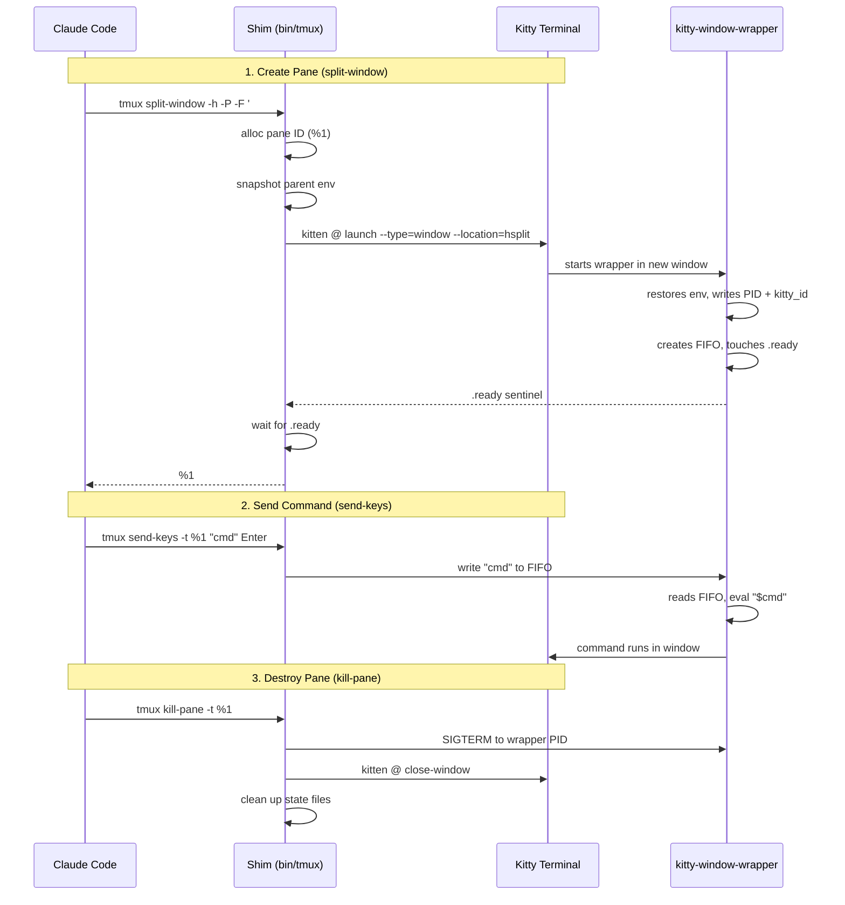

# kitty-tmux-wrapper

Use [Claude Code](https://docs.anthropic.com/en/docs/claude-code) **Agent Teams** inside [Kitty](https://sw.kovidgoyal.net/kitty/) — no tmux required.

## The Problem

Claude Code's Agent Teams feature spawns each teammate in its own terminal pane using **tmux**. If you use Kitty as your terminal (without tmux), Agent Teams falls back to in-process mode — no split panes, no visual separation.

## The Solution

This project provides a **tmux shim** — a fake `tmux` binary that intercepts Claude Code's tmux commands and translates them to Kitty remote control equivalents. Agent teammates spawn as real Kitty windows within your current tab.

```
┌──────────────────────┬──────────────────────┐
│                      │  researcher          │
│   Claude Code        ├──────────────────────┤
│   (your session)     │  implementer         │
│                      ├──────────────────────┤
│                      │  tester              │
└──────────────────────┴──────────────────────┘
```

Agent panes are created as Kitty windows with horizontal/vertical splits.

## Requirements

- **Kitty** 0.26+ (tested on 0.46.1)
- **Bash** 4+
- **Claude Code** with Agent Teams support
- **jq** or **python3** (optional, for future JSON parsing needs)

## Installation

```bash
git clone <repo-url> kitty-tmux-wrapper
cd kitty-tmux-wrapper
bash install.sh
```

The install script copies files to `${XDG_DATA_HOME:-~/.local/share}/kitty-tmux-shim/` and prints the activation snippet.

### Kitty Configuration

Add to `~/.config/kitty/kitty.conf`:

```conf
allow_remote_control yes
enabled_layouts splits
```

Or include provided config:

```conf
include /path/to/kitty-tmux-wrapper/extras/kitty-shim.conf
```

**Hybrid activation (recommended):**

The `kitty-shim.conf` file includes these env vars:

```conf
env TMUX=kitty-shim:/tmp/kitty-shim,$$,0
env TMUX_PANE=%0
```

This sets the fake tmux environment **automatically** when Kitty starts. Combined with manual PATH setup in your shell, this reduces configuration to just:

```bash
# Add to ~/.bashrc or ~/.zshrc:
export PATH="${XDG_DATA_HOME:-$HOME/.local/share}/kitty-tmux-shim/bin:$PATH"
```

When both kitty.conf and shell PATH are set correctly, the shim activates automatically without sourcing `activate.sh`. This is the simplest setup for everyday use.

Or include the provided config:

```conf
include /path/to/kitty-tmux-wrapper/extras/kitty-shim.conf
```

### Shell Activation

**Hybrid activation (recommended):** Minimal setup with kitty.conf env vars + shell PATH:

1. **Step 1: Add to `~/.config/kitty/kitty.conf`** (or include the config):
   ```conf
   include /path/to/kitty-tmux-wrapper/extras/kitty-shim.conf
   ```

2. **Step 2: Add to `~/.bashrc`** or `~/.zshrc`**:
   ```bash
   export PATH="${XDG_DATA_HOME:-$HOME/.local/share}/kitty-tmux-shim/bin:$PATH"
   ```

3. **Step 3: Restart Kitty**

That's it! The shim activates automatically when you start Kitty, with no need to source `activate.sh`.

**Traditional activation (full shell config):** If kitty.conf is not configured or you prefer full control:

Add **one** of these to your shell config:

**Bash** (`~/.bashrc`):
```bash
if [ -n "${KITTY_WINDOW_ID:-}" ]; then
    _shim="${XDG_DATA_HOME:-$HOME/.local/share}/kitty-tmux-shim/activate.sh"
    [ -f "$_shim" ] && . "$_shim"
    unset _shim
fi
```

**Zsh** (`~/.zshrc`):
```zsh
if [[ -n "${KITTY_WINDOW_ID:-}" ]]; then
    _shim="${XDG_DATA_HOME:-$HOME/.local/share}/kitty-tmux-shim/activate.sh"
    [[ -f "$_shim" ]] && source "$_shim"
    unset _shim
fi
```

Then restart your shell inside Kitty.

## Usage

Once activated, just use Claude Code normally inside Kitty:

```bash
claude           # start Claude Code
# Create a team → teammates appear as Kitty windows
```

The shim activates automatically when you're inside Kitty (it checks for the `$KITTY_WINDOW_ID` env var). Outside Kitty, it stays dormant.

### Deactivation

```bash
source ~/.local/share/kitty-tmux-shim/deactivate.sh
```

### Uninstall

```bash
cd kitty-tmux-wrapper
bash install.sh --uninstall
# Then remove the activation snippet from your shell config
```

## Configuration

| Variable | Default | Description |
|---|---|---|
| `KITTY_TMUX_SHIM_DEBUG` | unset | Set to `1` to log all tmux calls to `$STATE_DIR/shim.log` |

## How It Works

The shim uses Kitty's **remote control protocol** (`kitten @` commands):



### Environment Forwarding

Kitty's `kitten @ launch` does inherit the parent's environment when using `--cwd=current`. The wrapper also restores additional environment from a snapshot file for pane-specific variables (`TMUX_PANE`, state dir).

### Command Mapping

| Tmux Command | Kitty Equivalent | Behavior |
|---|---|---|
| `split-window -h` | `kitten @ launch --type=window --location=hsplit` | Horizontal split |
| `split-window -v` | `kitten @ launch --type=window --location=vsplit` | Vertical split |
| `new-window` | `kitten @ launch --type=tab` | New tab |
| `send-keys -t %N` | FIFO delivery or `kitten @ send-text` | Send command |
| `kill-pane -t %N` | SIGTERM + `kitten @ close-window` | Close window |
| `display-message -p '#{pane_id}'` | Return `$TMUX_PANE` | Query pane ID |
| `list-panes` | Scan state dir for active PIDs | List panes |
| `select-pane -t %N` | `kitten @ focus-window` | Focus window |
| `has-session` | Check sessions file | Session check |
| `new-session` | Track in sessions file | Session create |
| `select-layout`, `resize-pane`, etc. | No-op | Layout management |

## Troubleshooting

### Panes don't appear

1. **Remote control not enabled**: Check `allow_remote_control yes` in `kitty.conf`
2. **Shim not activated**: Run `echo $KITTY_TMUX_SHIM_ACTIVE` — should print `1`
3. **Check debug log**: `export KITTY_TMUX_SHIM_DEBUG=1` then check `$KITTY_TMUX_SHIM_STATE/shim.log`

### Commands not executing in panes

1. **Check FIFO**: `ls -la $KITTY_TMUX_SHIM_STATE/*.fifo`
2. **Check wrapper PID**: `cat $KITTY_TMUX_SHIM_STATE/<N>.pid` and verify with `kill -0 <pid>`
3. **Check Kitty windows**: `kitten @ ls | jq '.[] | .tabs[].windows[] | {id, title}'`

### kill-pane doesn't work

1. **Check PID**: `cat $KITTY_TMUX_SHIM_STATE/<N>.pid`
2. **Manually close**: `kitten @ close-window --match=id:<kitty_window_id>`

## Known Limitations

- **Layout management** — Kitty manages layouts automatically; tmux layout commands are no-ops
- **Pane styling** — No Kitty equivalent to tmux pane-border-style; styling commands are ignored
- **Hide/show panes** — Not implemented (would require moving to hidden tab)
- **Socket isolation** — Claude's `-L` socket isolation is ignored (stripped from args)
- **Fragile to Claude Code updates** — new tmux commands added upstream may need shim updates

## Compatibility

| Platform | Status |
|---|---|
| Linux (x86_64) | Tested |
| macOS (Apple Silicon) | Should work |
| macOS (Intel) | Should work |
| WSL2 | Untested |

## License

MIT
